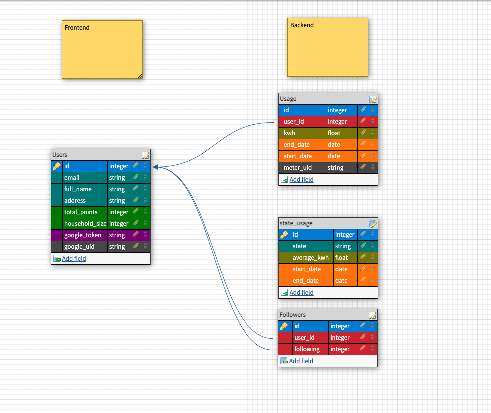

[![Contributors][contributors-shield]][contributors-url]
[![Forks][forks-shield]][forks-url]
[![Stargazers][stars-shield]][stars-url]
[![Issues][issues-shield]][issues-url]

# jules-api

### About this App

Jules API is the server-side application of Run the Jules. It consumes the utilities microservice to provide historical usage data and calcuate points for Run The Jules users. Users can sign up and compare their electricity usage with their friends or to an anonymous average in their area!

### Background and Description

"jules-api" is the backend API only application that handles the bulk of data interface for other applications. jules-api is part of a consultancy group project Run The Jules that student chosen project to build service-oreinted architecture application that allows the user to authenticate through Google and their electricity provider to compare their energy usage with other users.

### Goals accomplished
Consumed microservice API endpoints to package data for the frontend to consume
Robust unit and integration testing to ensure data quality
Navigate working together with a larger application base with many moving parts
Learned application design from the perspective of users' needs
Navigate how a small change can have huge impact in a SOA application
Setup continuous integration and deployment
Worked in short 3 or 4 day "Sprints" schedule
Worked in pairs
Deployed on Heroku, see endpoints

## Versions

- Ruby 2.5.3

- Rails 5.2.4.3

<!-- TABLE OF CONTENTS -->

  
Table of Contents

  <ol>
    <li>
      <a href="#about-the-project">About The Project</a>
      <ul>
        <li><a href="#built-with">Built With</a></li>
        <li><a href="#schema">Schema</a></li>
      </ul>
    </li>
    <li>
      <a href="#getting-started">Getting Started</a>
      <ul>
        <li><a href="#installation">Installation</a></li>
      </ul>
    </li>
    <li><a href="#contributing">Contributing</a></li>
    <li><a href="#license">License</a></li>
    <li><a href="#contact">Contact</a></li>
    <li><a href="#acknowledgements">Acknowledgements</a></li>
  </ol>

<!-- ABOUT THE PROJECT -->
### Built With

* [Ruby](https://www.ruby-lang.org/en/)
* [Ruby on Rails](https://github.com/rails/rails)

<!-- GETTING STARTED -->
## Getting Started

## Endpoints

### Utility Providers
`https://jules-api.herokuapp.com/api/v1/providers`
### User Authentication Through Provider
`https://jules-api.herokuapp.com/api/v1/new_users?{user_email}&utility={provider name}`  
  _user will be given an authentication url and once authenticated an referral number is provided_

`https://jules-api.herokuapp.com/api/v1/get_meters?referral={referral_number}`  
  _a meter activation request is sent on our end when the referral number is provided_

### User Data
`https://jules-api.herokuapp.com/api/v1/usages/{user_id}`  
`https://jules-api.herokuapp.com/api/v1/friendships?user_id={user_id}`

## Database Schema

<!-- CONTRIBUTING -->
## Contributing

Contributions are what make the open source community such an amazing place to be learn, inspire, and create. Any contributions you make are **greatly appreciated**.

1. Fork the Project
2. Create your Feature Branch (`git checkout -b feature/AmazingFeature`)
3. Commit your Changes (`git commit -m 'Add some AmazingFeature'`)
4. Push to the Branch (`git push origin feature/AmazingFeature`)
5. Open a Pull Request

<!-- LICENSE -->
## License

Distributed under the MIT License. See `LICENSE` for more information.

<!-- CONTACT -->
## Contact

- Alexander Osborne - [Github](https://github.com/AlexanderOsborne) [LinkedIn](https://www.linkedin.com/in/alex-osborne/)
- Aiden Mendez - [Github](https://github.com/aidenmendez) [LinkedIn](https://www.linkedin.com/in/aiden-mendez/)
- Catherine Dean - [Github](https://github.com/catherinemdean15) [LinkedIn](https://www.linkedin.com/in/catherine-dean-57a92030/)
- James Fox-Collis - [Github](https://github.com/jlfoxcollis) [LinkedIn](https://www.linkedin.com/in/james-fox-collis/)
- Robert Heath - [Github](https://github.com/kaiheiongaku) [LinkedIn](https://www.linkedin.com/in/robert-heath-305bb34b/)
- Joe Jiang - [Github](https://github.com/ninesky00) [LinkedIn](https://www.linkedin.com/in/joe-jiang01/)

Frontend Project Link: [https://github.com/run-the-jules/run-the-jules](https://github.com/run-the-jules/run-the-jules)

Microservice Project Link: [https://github.com/run-the-jules/joules-utility-microservice](https://github.com/run-the-jules/joules-utility-microservice)

<!-- ACKNOWLEDGEMENTS -->
## Acknowledgements
* [Img Shields](https://shields.io)
* [MIT Open Source License](https://opensource.org/licenses/MIT)
* [GitHub Pages](https://pages.github.com)

<!-- MARKDOWN LINKS & IMAGES -->
<!-- https://www.markdownguide.org/basic-syntax/#reference-style-links -->
[contributors-shield]: https://img.shields.io/github/contributors/run-the-jules/joules-utility-microservice.svg?style=for-the-badge
[contributors-url]: https://github.com/run-the-jules/joules-utility-microservice/graphs/contributors
[forks-shield]: https://img.shields.io/github/forks/run-the-jules/joules-utility-microservice.svg?style=for-the-badge
[forks-url]: https://github.com/run-the-jules/joules-utility-microservice/network/members
[stars-shield]: https://img.shields.io/github/stars/run-the-jules/joules-utility-microservice.svg?style=for-the-badge
[stars-url]: https://github.com/run-the-jules/joules-utility-microservice/stargazers
[issues-shield]: https://img.shields.io/github/issues/run-the-jules/joules-utility-microservice.svg?style=for-the-badge
[issues-url]: https://github.com/run-the-jules/joules-utility-microservice/issues
[product-screenshot]: images/screenshot.png
